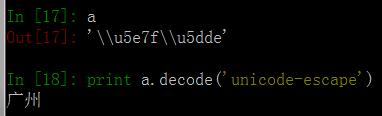
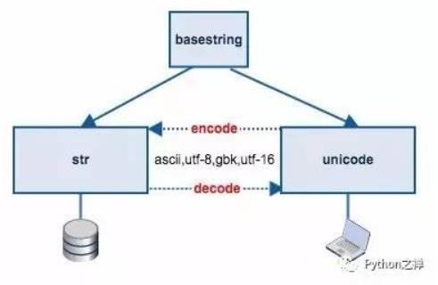
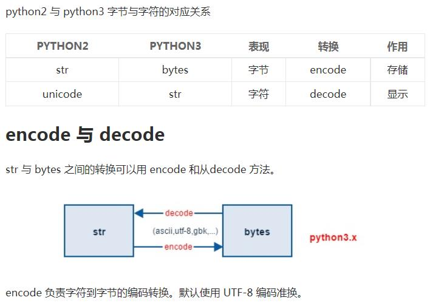
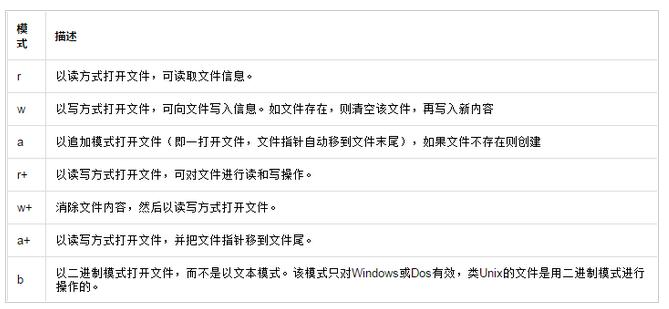
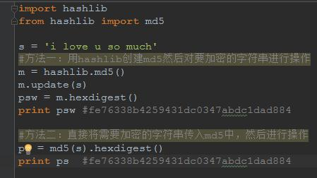
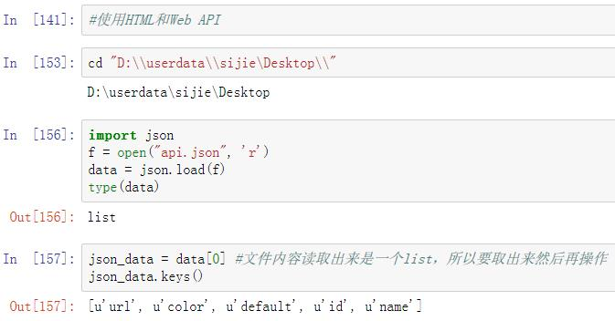
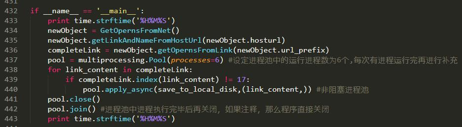

## Python学习记录

[TOC]


#### 字符串
- 字符串的替换
```python
两种替换方式：
1）str.replace('被替换字符'，‘替换字符’)
2）re.sub(pattern, repl, string, count=0, flags=0)
```
- 字符串的分割可以用split方法
```python
str.split(str="",num=string.count(str))[n]
str: 表示为分隔符，默认为空格，但是不能为空('')。若字符串中没有分隔符，则把整个字符串作为列表的一个元素
num: 表示分割次数。如果存在参数num，则仅分隔成 num+1 个子字符串，并且每一个子字符串可以赋给新的变量
[n]: 表示选取第n个分片
>>> str="hello boy<[www.doiido.com]>byebye"
>>> print str.split("[")[1].split("]")[0]
www.doiido.com
>>> print str.split("[")[1].split("]")[0].split(".")
['www', 'doiido', 'com']
```
- 字符串删除空格
```
s为字符串，rm为要删除的字符序列
s.strip(rm)   删除s字符串中开头、结尾处，位于 rm删除序列的字符
s.lstrip(rm)  删除s字符串中开头处，位于 rm删除序列的字符
s.rstrip(rm)  删除s字符串中结尾处，位于 rm删除序列的字符
```


#### 编码

- Python2中str类型的unicode字符转换成中文

  


- Python2和Python3中编码相互转换

  

  


#### 文件操作



为了避免将字符写入txt文件时一直没有显示的问题，应该使用'r+'这个模式

#### md5使用



#### json文件的解析



```python
json的loads方法用来加载一串json格式的字符串，转换成python类型。
      dump方法用来将python类型转换成json
```

#### Request实时流

```python
if not os.path.exists(current_songfile.format(track)):
    rs = requests.get(url_music,stream=True)
    if rs.status_code == 200:
        with open(current_songfile.format(track),'wb') as fd:
            print '{} is downloading...'.format(track)
            for music_stream in rs.iter_content():
                fd.write(music_stream)
            fd.close()
#于如上所示，使用 requests 进行实时流的下载，并即时的写入文件,最主要的地方在于 stream=True
```

#### 非阻塞进程池的应用




